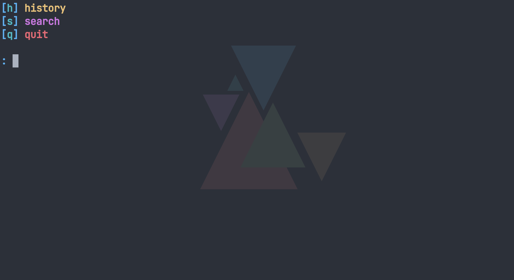
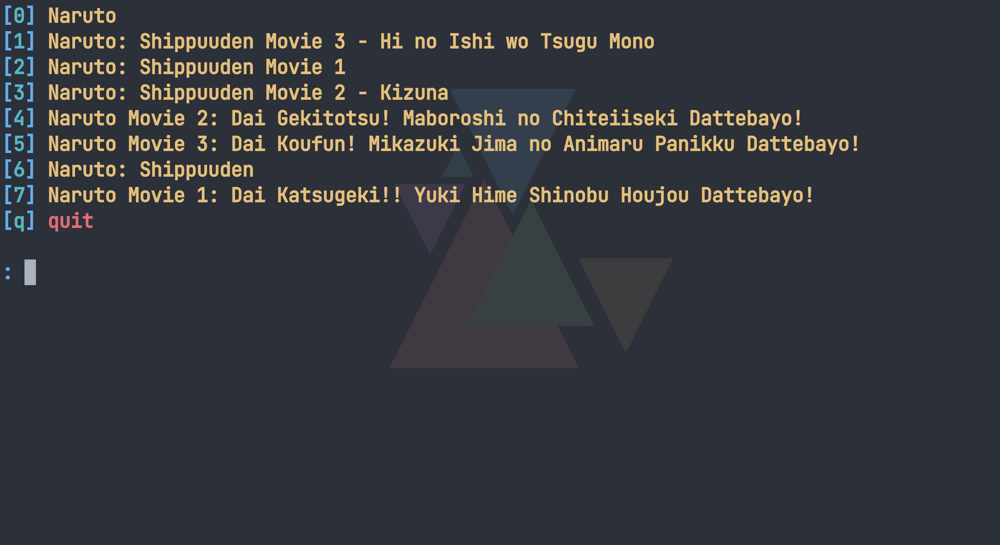
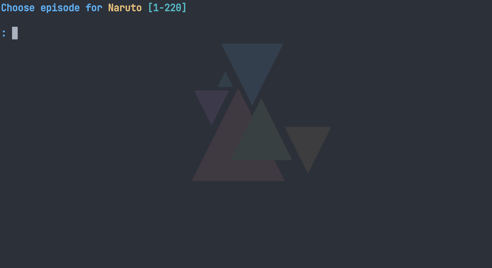
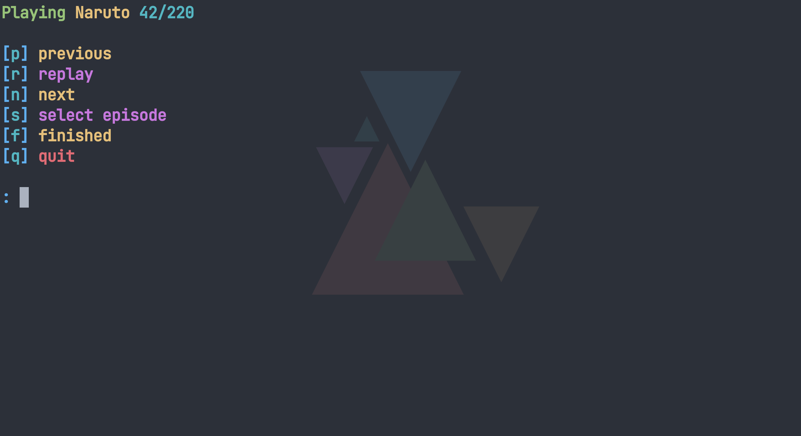
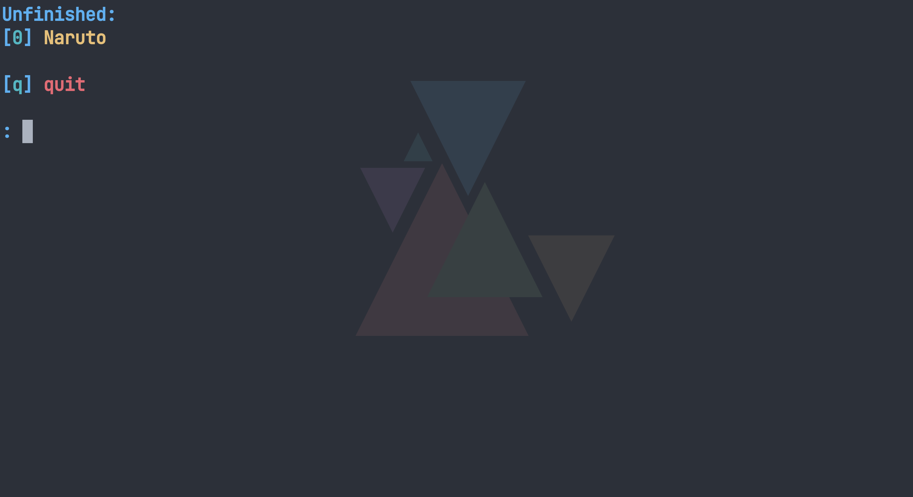

# anime

This project allows you to search and watch anime locally without the need to visit websites filled with ads and malware.

## Installation

You will find the main release [here](https://github.com/Mangobursche/anime_cli/releases/latest). This will have 3 Assets. The one you need will be called **anime.zip**. Download it, right click it and say **extract here**. I'd suggest you leave the executables in the folder, because the program will create 1 more files and you don't want it scattered around your computer , now, would you?

## Usage

After "installing" the program you are good to go. Execute **anime.exe** and you will see 2 windows. One is a command line interface and the other should be called **mpv**. Ignore the mpv one for now. The command line interface should now look something like this.

The command you have to type will always be the character between the **[]**. So to quit the program you'd have to press **q** and then **enter** to confirm.

You'll also see two other options. We will ignore the **history** for now and focus on **search**. As you'd have guessed we will need to type in **s**.

Here you can search for your favourite anime and the program should find it. In case you want to leave this search screen just press **enter** without entering anything and you will return to the main prompt.

Let's say we searched for **"naruto"**.

All the search results will be listed and you will be able to select the one you want by typing in the correct number, in my case the **0**.

Now you have to select the episode you'd want to watch. The range will be displayed. Again, if you want to exit this screen just press **enter** without entering anything and you will return. I'm gonna pick episode **42** and immediately the second window, which we had been ignoring will play the episode for us.

The video player supports

- pausing - spacebar | press the pause button
- fullscreen - f | press the button in the bottom right
- mute - m | press the volume symbol
- scrolling - left, right for slow and down, up for fast scrolling | use the progress bar
- volume - 9 volume down 0 volume up | use your mouse wheel over the volume symbol

The command line interface now also shows a new prompt.

I'm just gonna go over the commands really quick.

- previous - plays the previous episode
- replay - replays the current episode (in case you closed the video player window)
- next - plays the next episode
- select episode - gets you into the select episode screen
- finished - quits the anime and remembers, that you finished watching the current episode
- quit - quits the anime and remembers, that you didn't finish watching the current episode

After finishing episode **42** I'll type in **f**. A day later I want to watch **Naruto** again but I forgot which episode I was on. Lucky me that there's a feature. On the main screen we are now able to press **h** for history.

Here you will see all your unfinished anime (anime, where you haven't finished watching the last episode) and your finished ones. Choosing **0** would get me back to **Naruto** episode **43**. Choosing a finished anime will result in "rewatching" that anime (episode **1**).
